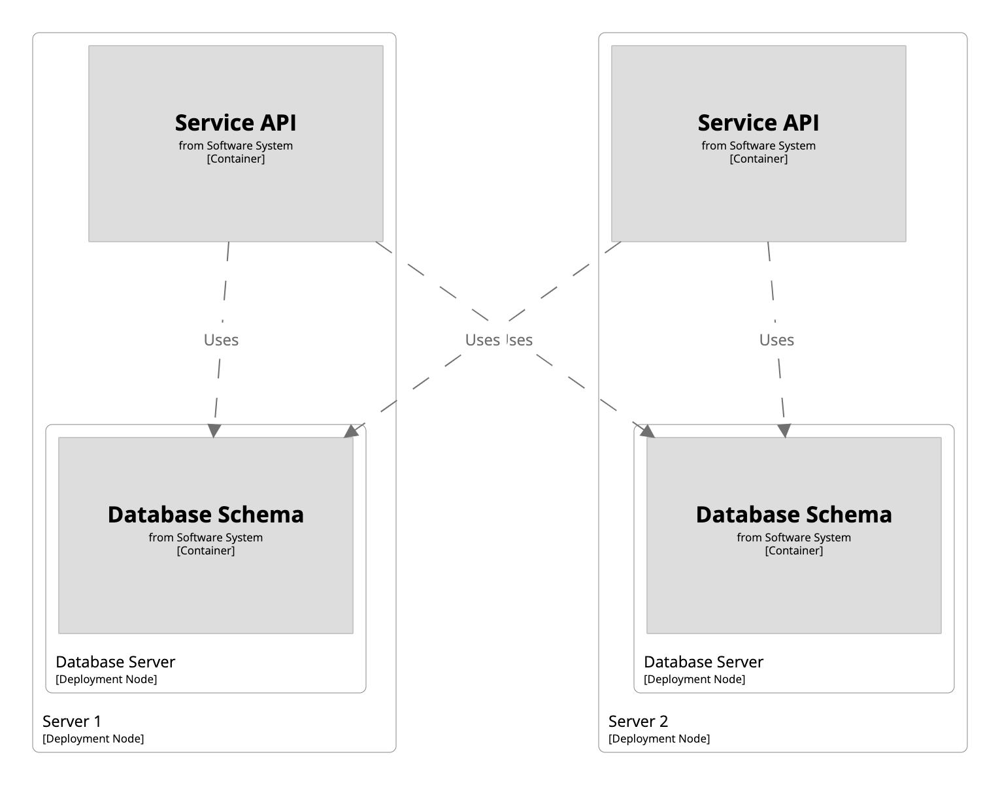
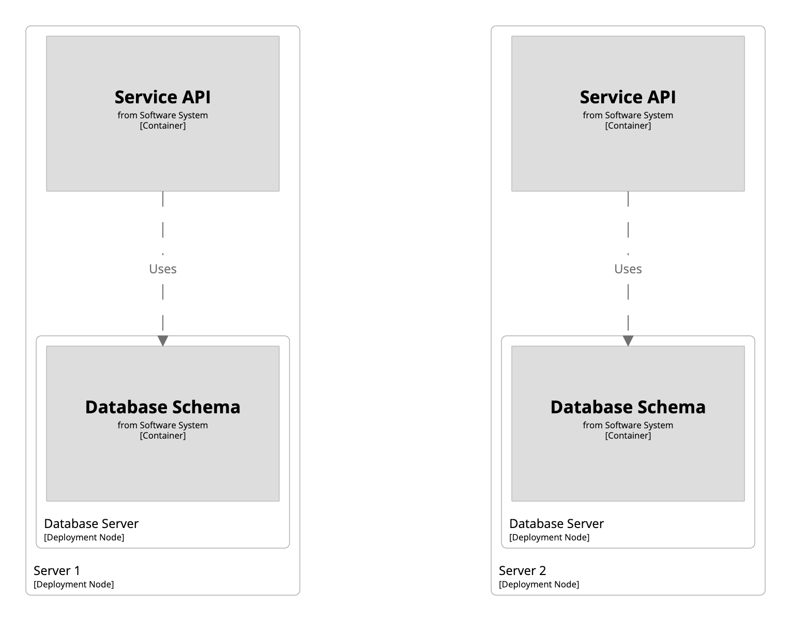

 [Skip to main content](index.md)   Link      Menu      Expand       (external link)    Document      Search       Copy       Copied

* [Home](https://docs.structurizr.com/)
* [Quickstart](https://docs.structurizr.com/quickstart)
* [Products](https://docs.structurizr.com/products)
* [Community tooling](https://docs.structurizr.com/community)
* [Workspaces](https://docs.structurizr.com/workspaces)
  * [Scope](https://docs.structurizr.com/workspaces/scope)
  * [Inspections](https://docs.structurizr.com/workspaces/inspections)
* [Usage](https://docs.structurizr.com/usage)
  * [Authoring](https://docs.structurizr.com/usage/authoring)
  * [Rendering](https://docs.structurizr.com/usage/rendering)
  * [Team](https://docs.structurizr.com/usage/team)
  * [Enterprise](https://docs.structurizr.com/usage/enterprise)
* [Structurizr DSL](../../index.md)
  * [Example](../../example/index.md)
  * [Tutorial](../../tutorial/index.md)
  * [Basics](../../basics/index.md)
  * [Defaults](../../defaults/index.md)
  * [Identifiers](../../identifiers/index.md)
  * [Archetypes](../../archetypes/index.md)
  * [Implied relationships](../../implied-relationships/index.md)
  * [Expressions](../../expressions/index.md)
  * [Includes](../../includes/index.md)
  * [Workspace extension](../../workspace-extension/index.md)
  * [Markdown/Asciidoc documentation](../../docs/index.md)
  * [Architecture Decision Records (ADRs)](../../adrs/index.md)
  * [Scripts](../../scripts/index.md)
  * [Plugins](../../plugins/index.md)
    * [PlantUML](../../plugins/plantuml/index.md)
    * [Mermaid](../../plugins/mermaid/index.md)
  * [Language reference](../../language/index.md)
  * [FAQ](../../faq/index.md)
  * [Cookbook](../index.md)
    * [Amazon Web Services](../amazon-web-services/index.md)
    * [Bulk operations - elements](../bulk-operations-elements/index.md)
    * [Component view](../component-view/index.md)
    * [Container view](../container-view/index.md)
    * [Container view (for multiple software systems)](../container-view-multiple-software-systems/index.md)
    * [Custom elements](../custom-elements/index.md)
    * [Custom view](../custom-view/index.md)
    * [DSL and code](../dsl-and-code/index.md)
    * [Deployment groups](index.md)
    * [Deployment view](../deployment-view/index.md)
    * [Dynamic view](../dynamic-view/index.md)
    * [Dynamic view (with parallel sequences)](../dynamic-view-parallel/index.md)
    * [Element styles](../element-styles/index.md)
    * [Filtered view](../filtered-view/index.md)
    * [Groups](../groups/index.md)
    * [Image view](../image-view/index.md)
    * [Implied relationships](../implied-relationships/index.md)
    * [Perspectives](../perspectives/index.md)
    * [Relationship styles](../relationship-styles/index.md)
    * [Scripts](../scripts/index.md)
    * [Shared components](../shared-components/index.md)
    * [System context view](../system-context-view/index.md)
    * [Themes](../themes/index.md)
    * [Workspace](../workspace/index.md)
    * [Workspace extension](../workspace-extension/index.md)
* [Structurizr for Java](https://docs.structurizr.com/java)
  * [Getting started](https://docs.structurizr.com/java/getting-started)
  * [Workspace API client](https://docs.structurizr.com/java/workspace-api)
  * [Implied relationships](https://docs.structurizr.com/java/implied-relationships)
  * [Component finder](https://docs.structurizr.com/java/component)
    * [Introduction](https://docs.structurizr.com/java/component/introduction)
  * [Building from source](https://docs.structurizr.com/java/building)
  * [FAQ](https://docs.structurizr.com/java/faq)
* [Structurizr Lite](https://docs.structurizr.com/lite)
  * [Quickstart](https://docs.structurizr.com/lite/quickstart)
  * [Installation](https://docs.structurizr.com/lite/installation)
  * [Usage](https://docs.structurizr.com/lite/usage)
  * [Workflow](https://docs.structurizr.com/lite/workflow)
  * [Building from source](https://docs.structurizr.com/lite/building)
  * [FAQ](https://docs.structurizr.com/lite/faq)
  * [Troubleshooting](https://docs.structurizr.com/lite/troubleshooting)
* [Structurizr on-premises](https://docs.structurizr.com/onpremises)
  * [Quickstart](https://docs.structurizr.com/onpremises/quickstart)
  * [Installation](https://docs.structurizr.com/onpremises/installation)
  * [Usage](https://docs.structurizr.com/onpremises/usage)
  * [Configuration](https://docs.structurizr.com/onpremises/configuration)
  * [Customisation](https://docs.structurizr.com/onpremises/customisation)
  * [Authentication](https://docs.structurizr.com/onpremises/authentication)
    * [File](https://docs.structurizr.com/onpremises/authentication/file)
    * [LDAP](https://docs.structurizr.com/onpremises/authentication/ldap)
    * [SAML](https://docs.structurizr.com/onpremises/authentication/saml)
  * [Role-based access](https://docs.structurizr.com/onpremises/role-based-access)
  * [HTTP sessions](https://docs.structurizr.com/onpremises/http-sessions)
  * [Data storage](https://docs.structurizr.com/onpremises/data-storage)
  * [Workspace versioning](https://docs.structurizr.com/onpremises/workspace-versioning)
  * [Workspace branches](https://docs.structurizr.com/onpremises/workspace-branches)
  * [Workspace API](https://docs.structurizr.com/onpremises/workspace-api)
  * [Admin API](https://docs.structurizr.com/onpremises/admin-api)
  * [Embedding diagrams](https://docs.structurizr.com/onpremises/embed)
  * [Diagram review](https://docs.structurizr.com/onpremises/diagram-review)
  * [Building from source](https://docs.structurizr.com/onpremises/building)
  * [FAQ](https://docs.structurizr.com/onpremises/faq)
  * [Troubleshooting](https://docs.structurizr.com/onpremises/troubleshooting)
* [Structurizr cloud service](https://docs.structurizr.com/cloud)
  * [Quickstart](https://docs.structurizr.com/cloud/quickstart)
  * [Workspace settings](https://docs.structurizr.com/cloud/workspace-settings)
  * [Workspace visibility](https://docs.structurizr.com/cloud/workspace-visibility)
  * [Role-based access](https://docs.structurizr.com/cloud/role-based-access)
  * [Client-side encryption](https://docs.structurizr.com/cloud/client-side-encryption)
  * [IP address restrictions](https://docs.structurizr.com/cloud/ip-address-restrictions)
  * [Workspace branches](https://docs.structurizr.com/cloud/workspace-branches)
  * [Workspace versioning](https://docs.structurizr.com/cloud/workspace-versioning)
  * [Workspace locking](https://docs.structurizr.com/cloud/workspace-locking)
  * [Workspace API](https://docs.structurizr.com/cloud/workspace-api)
  * [Admin API](https://docs.structurizr.com/cloud/admin-api)
  * [Embedding diagrams](https://docs.structurizr.com/cloud/embed)
  * [Notion](https://docs.structurizr.com/cloud/notion)
  * [Slack](https://docs.structurizr.com/cloud/slack)
  * [Diagram review](https://docs.structurizr.com/cloud/diagram-review)
* [Structurizr static site](https://docs.structurizr.com/static)
  * [Generating a static site](https://docs.structurizr.com/static/generating)
  * [Embedding diagrams](https://docs.structurizr.com/static/embed)
* [Structurizr UI](https://docs.structurizr.com/ui)
  * [Diagrams](https://docs.structurizr.com/ui/diagrams/)
    * [System landscape view](https://docs.structurizr.com/ui/diagrams/system-landscape-view)
    * [System context view](https://docs.structurizr.com/ui/diagrams/system-context-view)
    * [Container view](https://docs.structurizr.com/ui/diagrams/container-view)
    * [Component view](https://docs.structurizr.com/ui/diagrams/component-view)
    * [Code view](https://docs.structurizr.com/ui/diagrams/code-view)
    * [Image view](https://docs.structurizr.com/ui/diagrams/image-view)
    * [Dynamic view](https://docs.structurizr.com/ui/diagrams/dynamic-view)
    * [Deployment view](https://docs.structurizr.com/ui/diagrams/deployment-view)
    * [Filtered view](https://docs.structurizr.com/ui/diagrams/filtered-view)
    * [Custom view](https://docs.structurizr.com/ui/diagrams/custom-view)
    * [Diagram editor](https://docs.structurizr.com/ui/diagrams/editor)
    * [Automatic layout](https://docs.structurizr.com/ui/diagrams/automatic-layout)
    * [Manual layout](https://docs.structurizr.com/ui/diagrams/manual-layout)
    * [Notation](https://docs.structurizr.com/ui/diagrams/notation)
    * [Themes](https://docs.structurizr.com/ui/diagrams/themes)
    * [Branding](https://docs.structurizr.com/ui/diagrams/branding)
    * [Navigation](https://docs.structurizr.com/ui/diagrams/navigation)
    * [Diagram sorting](https://docs.structurizr.com/ui/diagrams/sorting)
    * [Keyboard shortcuts](https://docs.structurizr.com/ui/diagrams/keyboard-shortcuts)
    * [Perspectives](https://docs.structurizr.com/ui/diagrams/perspectives)
    * [Health checks](https://docs.structurizr.com/ui/diagrams/health-checks)
    * [Animation](https://docs.structurizr.com/ui/diagrams/animation)
    * [Presentation mode](https://docs.structurizr.com/ui/diagrams/presentation)
    * [PNG/SVG export](https://docs.structurizr.com/ui/diagrams/export)
  * [Documentation](https://docs.structurizr.com/ui/documentation/)
    * [Headings and section numbers](https://docs.structurizr.com/ui/documentation/headings)
    * [Diagrams](https://docs.structurizr.com/ui/documentation/diagrams)
    * [Images](https://docs.structurizr.com/ui/documentation/images)
    * [Branding](https://docs.structurizr.com/ui/documentation/branding)
    * [Export](https://docs.structurizr.com/ui/documentation/export)
  * [Decisions](https://docs.structurizr.com/ui/decisions/)
  * [Properties](https://docs.structurizr.com/ui/properties)
  * [Explorations](https://docs.structurizr.com/ui/explorations/)
  * [Quick navigation](https://docs.structurizr.com/ui/quick-navigation)
  * [Dark mode](https://docs.structurizr.com/ui/dark-mode)
  * [Scripting](https://docs.structurizr.com/ui/scripting)
  * [FAQ](https://docs.structurizr.com/ui/faq)
* [Structurizr CLI](https://docs.structurizr.com/cli)
  * [Installation](https://docs.structurizr.com/cli/installation)
  * [push](https://docs.structurizr.com/cli/push)
  * [pull](https://docs.structurizr.com/cli/pull)
  * [lock](https://docs.structurizr.com/cli/lock)
  * [unlock](https://docs.structurizr.com/cli/unlock)
  * [export](https://docs.structurizr.com/cli/export)
  * [merge](https://docs.structurizr.com/cli/merge)
  * [list](https://docs.structurizr.com/cli/list)
  * [validate](https://docs.structurizr.com/cli/validate)
  * [inspect](https://docs.structurizr.com/cli/inspect)
  * [Building from source](https://docs.structurizr.com/cli/building)
* [Exporters](https://docs.structurizr.com/export)
  * [Comparison](https://docs.structurizr.com/export/comparison)
  * [PlantUML](https://docs.structurizr.com/export/plantuml)
  * [Mermaid](https://docs.structurizr.com/export/mermaid)
  * [DOT](https://docs.structurizr.com/export/dot)
  * [WebSequenceDiagrams](https://docs.structurizr.com/export/websequencediagrams)
  * [Ilograph](https://docs.structurizr.com/export/ilograph)
  * [D2](https://docs.structurizr.com/export/d2)
  * [Custom exporters](https://docs.structurizr.com/export/custom)
* [Contribute](https://docs.structurizr.com/contribute)
* [Support](https://docs.structurizr.com/support)

* [Patreon](https://patreon.com/structurizr)
  This site uses [Just the Docs](https://github.com/just-the-docs/just-the-docs), a documentation theme for Jekyll.

1. [Structurizr DSL](../../index.md)
2. [Cookbook](../index.md)
3. Deployment groups

# Deployment groups

Imagine that you have a service comprised of an API and a database scheme, which are deployed together onto a single server. Now let’s say there are two instances of this entire service, each deployed onto a separate server.

```
workspace {

    model {
        softwareSystem = softwareSystem "Software System" {
            database = container "Database Schema"
            api = container "Service API" {
                -> database "Uses"
            }
        }

        production = deploymentEnvironment "Production" {
            deploymentNode "Server 1" {
                containerInstance api
                deploymentNode "Database Server" {
                    containerInstance database
                }
            }
            deploymentNode "Server 2" {
                containerInstance api
                deploymentNode "Database Server" {
                    containerInstance database
                }
            }
        }
    }

    views {
        deployment * production {
            include *
            autolayout
        }
    }

}

```

The container instance to container instance relationships are based upon the container to container relationships defined in the static structure part of the model. While this works out of the box in many cases, here we can see that the “Service API” on “Server 1” has a connection to the “Database Schema” on “Server 2”, and vice versa.

[](http://structurizr.com/dsl?src=https://docs.structurizr.com/dsl/cookbook/deployment-groups/example-1.dsl)

If this is not the desired behaviour, you can use the “deployment group” feature, which provides a way to group software system/container instances and restrict how relationships are created between them. For example, we can create two deployment groups, and place one instance of both the “Service API” and “Database Schema” in each.

```
workspace {

    model {
        softwareSystem = softwareSystem "Software System" {
            database = container "Database Schema"
            api = container "Service API" {
                -> database "Uses"
            }
        }

        production = deploymentEnvironment "Production" {
            serviceInstance1 = deploymentGroup "Service instance 1"
            serviceInstance2 = deploymentGroup "Service instance 2"

            deploymentNode "Server 1" {
                containerInstance api serviceInstance1
                deploymentNode "Database Server" {
                    containerInstance database serviceInstance1
                }
            }
            deploymentNode "Server 2" {
                containerInstance api serviceInstance2
                deploymentNode "Database Server" {
                    containerInstance database serviceInstance2
                }
            }
        }
    }

    views {
        deployment * production {
            include *
            autolayout
        }
    }

}

```

[](http://structurizr.com/dsl?src=https://docs.structurizr.com/dsl/cookbook/deployment-groups/example-2.dsl)

## Links

* [DSL language reference - deploymentGroup](../../language/index.md)


---


[Edit this page on GitHub.](https://github.com/structurizr/structurizr.github.io/tree/main/dsl/cookbook/deployment-groups/index.md)