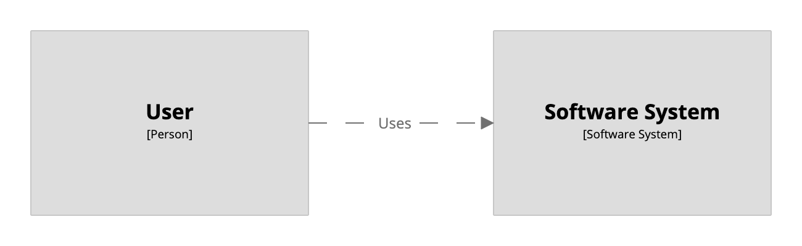

 [Skip to main content](#main-content)   Link      Menu      Expand       (external link)    Document      Search       Copy       Copied

* [Home](../../../index.md)
* [Quickstart](../../../quickstart/index.md)
* [Products](../../../products/index.md)
* [Community tooling](../../../community/index.md)
* [Workspaces](../../../workspaces/index.md)
  * [Scope](../../../workspaces/scope/index.md)
  * [Inspections](../../../workspaces/inspections/index.md)
* [Usage](../../../usage/index.md)
  * [Authoring](../../../usage/authoring/index.md)
  * [Rendering](../../../usage/rendering/index.md)
  * [Team](../../../usage/team/index.md)
  * [Enterprise](../../../usage/enterprise/index.md)
* [Structurizr DSL](../../index.md)
  * [Example](../../example/index.md)
  * [Tutorial](../../tutorial/index.md)
  * [Basics](../../basics/index.md)
  * [Defaults](../../defaults/index.md)
  * [Identifiers](../../identifiers/index.md)
  * [Archetypes](../../archetypes/index.md)
  * [Implied relationships](../../implied-relationships/index.md)
  * [Expressions](../../expressions/index.md)
  * [Includes](../../includes/index.md)
  * [Workspace extension](../../workspace-extension/index.md)
  * [Markdown/Asciidoc documentation](../../docs/index.md)
  * [Architecture Decision Records (ADRs)](../../adrs/index.md)
  * [Scripts](../../scripts/index.md)
  * [Plugins](../../plugins/index.md)
    * [PlantUML](../../plugins/plantuml/index.md)
    * [Mermaid](../../plugins/mermaid/index.md)
  * [Language reference](../../language/index.md)
  * [FAQ](../../faq/index.md)
  * [Cookbook](../index.md)
    * [Amazon Web Services](../amazon-web-services/index.md)
    * [Bulk operations - elements](../bulk-operations-elements/index.md)
    * [Component view](../component-view/index.md)
    * [Container view](../container-view/index.md)
    * [Container view (for multiple software systems)](../container-view-multiple-software-systems/index.md)
    * [Custom elements](../custom-elements/index.md)
    * [Custom view](../custom-view/index.md)
    * [DSL and code](../dsl-and-code/index.md)
    * [Deployment groups](../deployment-groups/index.md)
    * [Deployment view](../deployment-view/index.md)
    * [Dynamic view](../dynamic-view/index.md)
    * [Dynamic view (with parallel sequences)](../dynamic-view-parallel/index.md)
    * [Element styles](../element-styles/index.md)
    * [Filtered view](../filtered-view/index.md)
    * [Groups](../groups/index.md)
    * [Image view](../image-view/index.md)
    * [Implied relationships](../implied-relationships/index.md)
    * [Perspectives](../perspectives/index.md)
    * [Relationship styles](../relationship-styles/index.md)
    * [Scripts](../scripts/index.md)
    * [Shared components](../shared-components/index.md)
    * [System context view](index.md)
    * [Themes](../themes/index.md)
    * [Workspace](../workspace/index.md)
    * [Workspace extension](../workspace-extension/index.md)
* [Structurizr for Java](../../../java/index.md)
  * [Getting started](../../../java/getting-started/index.md)
  * [Workspace API client](../../../java/workspace-api/index.md)
  * [Implied relationships](../../../java/implied-relationships/index.md)
  * [Component finder](../../../java/component/index.md)
    * [Introduction](../../../java/component/introduction/index.md)
  * [Building from source](../../../java/building/index.md)
  * [FAQ](../../../java/faq/index.md)
* [Structurizr Lite](../../../lite/index.md)
  * [Quickstart](../../../lite/quickstart/index.md)
  * [Installation](../../../lite/installation/index.md)
  * [Usage](../../../lite/usage/index.md)
  * [Workflow](../../../lite/workflow/index.md)
  * [Building from source](../../../lite/building/index.md)
  * [FAQ](../../../lite/faq/index.md)
  * [Troubleshooting](../../../lite/troubleshooting/index.md)
* [Structurizr on-premises](../../../onpremises/index.md)
  * [Quickstart](../../../onpremises/quickstart/index.md)
  * [Installation](../../../onpremises/installation/index.md)
  * [Usage](../../../onpremises/usage/index.md)
  * [Configuration](../../../onpremises/configuration/index.md)
  * [Customisation](../../../onpremises/customisation/index.md)
  * [Authentication](../../../onpremises/authentication/index.md)
    * [File](../../../onpremises/authentication/file/index.md)
    * [LDAP](../../../onpremises/authentication/ldap/index.md)
    * [SAML](../../../onpremises/authentication/saml/index.md)
  * [Role-based access](../../../onpremises/role-based-access/index.md)
  * [HTTP sessions](../../../onpremises/http-sessions/index.md)
  * [Data storage](../../../onpremises/data-storage/index.md)
  * [Workspace versioning](../../../onpremises/workspace-versioning/index.md)
  * [Workspace branches](../../../onpremises/workspace-branches/index.md)
  * [Workspace API](../../../onpremises/workspace-api/index.md)
  * [Admin API](../../../onpremises/admin-api/index.md)
  * [Embedding diagrams](../../../onpremises/embed/index.md)
  * [Diagram review](../../../onpremises/diagram-review/index.md)
  * [Building from source](../../../onpremises/building/index.md)
  * [FAQ](../../../onpremises/faq/index.md)
  * [Troubleshooting](../../../onpremises/troubleshooting/index.md)
* [Structurizr cloud service](../../../cloud/index.md)
  * [Quickstart](../../../cloud/quickstart/index.md)
  * [Workspace settings](../../../cloud/workspace-settings/index.md)
  * [Workspace visibility](../../../cloud/workspace-visibility/index.md)
  * [Role-based access](../../../cloud/role-based-access/index.md)
  * [Client-side encryption](../../../cloud/client-side-encryption/index.md)
  * [IP address restrictions](../../../cloud/ip-address-restrictions/index.md)
  * [Workspace branches](../../../cloud/workspace-branches/index.md)
  * [Workspace versioning](../../../cloud/workspace-versioning/index.md)
  * [Workspace locking](../../../cloud/workspace-locking/index.md)
  * [Workspace API](../../../cloud/workspace-api/index.md)
  * [Admin API](../../../cloud/admin-api/index.md)
  * [Embedding diagrams](../../../cloud/embed/index.md)
  * [Notion](../../../cloud/notion/index.md)
  * [Slack](../../../cloud/slack/index.md)
  * [Diagram review](../../../cloud/diagram-review/index.md)
* [Structurizr static site](../../../static/index.md)
  * [Generating a static site](../../../static/generating/index.md)
  * [Embedding diagrams](../../../static/embed/index.md)
* [Structurizr UI](../../../ui/index.md)
  * [Diagrams](../../../ui/diagrams/index.md)
    * [System landscape view](../../../ui/diagrams/system-landscape-view/index.md)
    * [System context view](../../../ui/diagrams/system-context-view/index.md)
    * [Container view](../../../ui/diagrams/container-view/index.md)
    * [Component view](../../../ui/diagrams/component-view/index.md)
    * [Code view](../../../ui/diagrams/code-view/index.md)
    * [Image view](../../../ui/diagrams/image-view/index.md)
    * [Dynamic view](../../../ui/diagrams/dynamic-view/index.md)
    * [Deployment view](../../../ui/diagrams/deployment-view/index.md)
    * [Filtered view](../../../ui/diagrams/filtered-view/index.md)
    * [Custom view](../../../ui/diagrams/custom-view/index.md)
    * [Diagram editor](../../../ui/diagrams/editor/index.md)
    * [Automatic layout](../../../ui/diagrams/automatic-layout/index.md)
    * [Manual layout](../../../ui/diagrams/manual-layout/index.md)
    * [Notation](../../../ui/diagrams/notation/index.md)
    * [Themes](../../../ui/diagrams/themes/index.md)
    * [Branding](../../../ui/diagrams/branding/index.md)
    * [Navigation](../../../ui/diagrams/navigation/index.md)
    * [Diagram sorting](../../../ui/diagrams/sorting/index.md)
    * [Keyboard shortcuts](../../../ui/diagrams/keyboard-shortcuts/index.md)
    * [Perspectives](../../../ui/diagrams/perspectives/index.md)
    * [Health checks](../../../ui/diagrams/health-checks/index.md)
    * [Animation](../../../ui/diagrams/animation/index.md)
    * [Presentation mode](../../../ui/diagrams/presentation/index.md)
    * [PNG/SVG export](../../../ui/diagrams/export/index.md)
  * [Documentation](../../../ui/documentation/index.md)
    * [Headings and section numbers](../../../ui/documentation/headings/index.md)
    * [Diagrams](../../../ui/documentation/diagrams/index.md)
    * [Images](../../../ui/documentation/images/index.md)
    * [Branding](../../../ui/documentation/branding/index.md)
    * [Export](../../../ui/documentation/export/index.md)
  * [Decisions](../../../ui/decisions/index.md)
  * [Properties](../../../ui/properties/index.md)
  * [Explorations](../../../ui/explorations/index.md)
  * [Quick navigation](../../../ui/quick-navigation/index.md)
  * [Dark mode](../../../ui/dark-mode/index.md)
  * [Scripting](../../../ui/scripting/index.md)
  * [FAQ](../../../ui/faq/index.md)
* [Structurizr CLI](../../../cli/index.md)
  * [Installation](../../../cli/installation/index.md)
  * [push](../../../cli/push/index.md)
  * [pull](../../../cli/pull/index.md)
  * [lock](../../../cli/lock/index.md)
  * [unlock](../../../cli/unlock/index.md)
  * [export](../../../cli/export/index.md)
  * [merge](../../../cli/merge/index.md)
  * [list](../../../cli/list/index.md)
  * [validate](../../../cli/validate/index.md)
  * [inspect](../../../cli/inspect/index.md)
  * [Building from source](../../../cli/building/index.md)
* [Exporters](../../../export/index.md)
  * [Comparison](../../../export/comparison/index.md)
  * [PlantUML](../../../export/plantuml/index.md)
  * [Mermaid](../../../export/mermaid/index.md)
  * [DOT](../../../export/dot/index.md)
  * [WebSequenceDiagrams](../../../export/websequencediagrams/index.md)
  * [Ilograph](../../../export/ilograph/index.md)
  * [D2](../../../export/d2/index.md)
  * [Custom exporters](../../../export/custom/index.md)
* [Contribute](../../../contribute/index.md)
* [Support](../../../support/index.md)

* [Patreon](https://patreon.com/structurizr)
  This site uses [Just the Docs](https://github.com/just-the-docs/just-the-docs), a documentation theme for Jekyll.

1. [Structurizr DSL](../../index.md)
2. [Cookbook](../index.md)
3. System context view

# System Context view

A [system context view](https://c4model.com/) is a good starting point for diagramming and documenting a software system, allowing you to step back and see the big picture. It shows the software system in the centre, surrounded by its users and the other systems that it interacts with.

```
workspace {

    model {
        u = person "User"
        s = softwareSystem "Software System"

        u -> s "Uses"
    }

    views {
        systemContext s {
            include *
            autoLayout lr
        }
    }

}

```

This DSL defines a system context view for the software system `s`, and `include *` includes all model elements that have a direct relationship with it.

[](http://structurizr.com/dsl?src=https://docs.structurizr.com/dsl/cookbook/system-context-view/example-1.dsl)

System context views can be rendered using the Structurizr cloud service/on-premises installation or exported to a number of other formats via the [Structurizr CLI export command](https://github.com/structurizr/cli/blob/master/docs/export.md).

## Links

* [DSL language reference - systemContext](../../language/index.md)


---


[Edit this page on GitHub.](https://github.com/structurizr/structurizr.github.io/tree/main/dsl/cookbook/system-context-view/index.md)