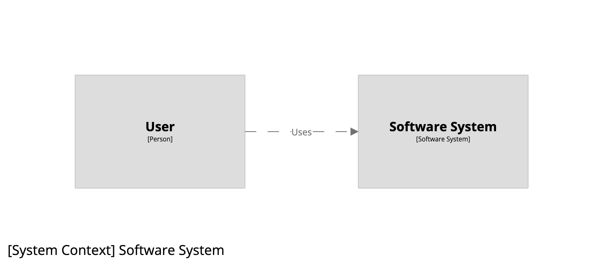
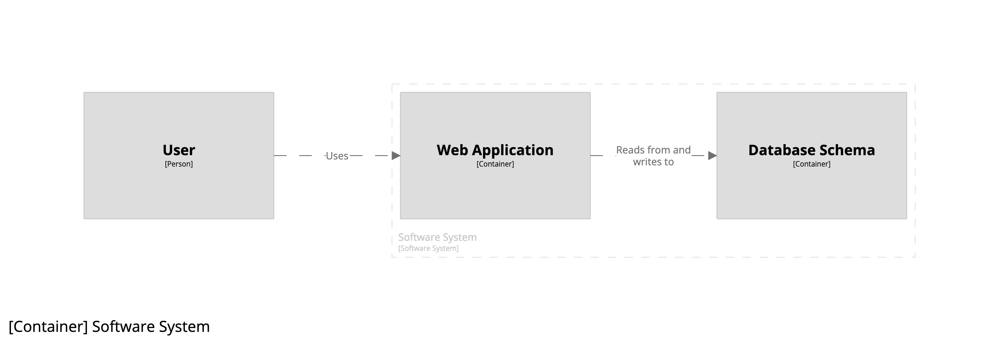
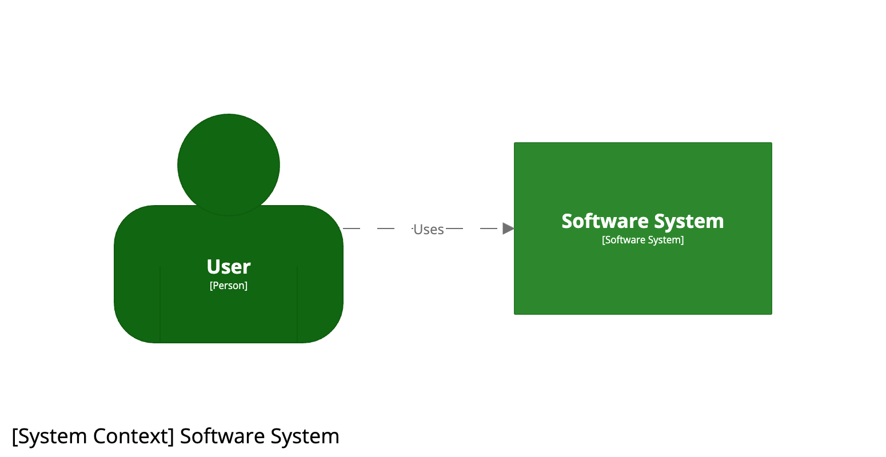
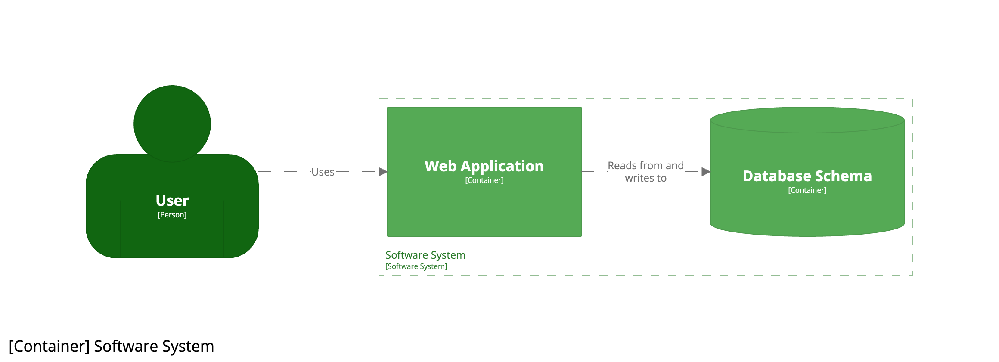
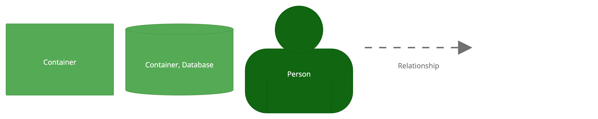

 [Skip to main content](#main-content)   Link      Menu      Expand       (external link)    Document      Search       Copy       Copied

* [Home](../../index.md)
* [Quickstart](../../quickstart/index.md)
* [Products](../../products/index.md)
* [Community tooling](../../community/index.md)
* [Workspaces](../../workspaces/index.md)
  * [Scope](../../workspaces/scope/index.md)
  * [Inspections](../../workspaces/inspections/index.md)
* [Usage](../../usage/index.md)
  * [Authoring](../../usage/authoring/index.md)
  * [Rendering](../../usage/rendering/index.md)
  * [Team](../../usage/team/index.md)
  * [Enterprise](../../usage/enterprise/index.md)
* [Structurizr DSL](../index.md)
  * [Example](../example/index.md)
  * [Tutorial](index.md)
  * [Basics](../basics/index.md)
  * [Defaults](../defaults/index.md)
  * [Identifiers](../identifiers/index.md)
  * [Archetypes](../archetypes/index.md)
  * [Implied relationships](../implied-relationships/index.md)
  * [Expressions](../expressions/index.md)
  * [Includes](../includes/index.md)
  * [Workspace extension](../workspace-extension/index.md)
  * [Markdown/Asciidoc documentation](../docs/index.md)
  * [Architecture Decision Records (ADRs)](../adrs/index.md)
  * [Scripts](../scripts/index.md)
  * [Plugins](../plugins/index.md)
    * [PlantUML](../plugins/plantuml/index.md)
    * [Mermaid](../plugins/mermaid/index.md)
  * [Language reference](../language/index.md)
  * [FAQ](../faq/index.md)
  * [Cookbook](../cookbook/index.md)
    * [Amazon Web Services](../cookbook/amazon-web-services/index.md)
    * [Bulk operations - elements](../cookbook/bulk-operations-elements/index.md)
    * [Component view](../cookbook/component-view/index.md)
    * [Container view](../cookbook/container-view/index.md)
    * [Container view (for multiple software systems)](../cookbook/container-view-multiple-software-systems/index.md)
    * [Custom elements](../cookbook/custom-elements/index.md)
    * [Custom view](../cookbook/custom-view/index.md)
    * [DSL and code](../cookbook/dsl-and-code/index.md)
    * [Deployment groups](../cookbook/deployment-groups/index.md)
    * [Deployment view](../cookbook/deployment-view/index.md)
    * [Dynamic view](../cookbook/dynamic-view/index.md)
    * [Dynamic view (with parallel sequences)](../cookbook/dynamic-view-parallel/index.md)
    * [Element styles](../cookbook/element-styles/index.md)
    * [Filtered view](../cookbook/filtered-view/index.md)
    * [Groups](../cookbook/groups/index.md)
    * [Image view](../cookbook/image-view/index.md)
    * [Implied relationships](../cookbook/implied-relationships/index.md)
    * [Perspectives](../cookbook/perspectives/index.md)
    * [Relationship styles](../cookbook/relationship-styles/index.md)
    * [Scripts](../cookbook/scripts/index.md)
    * [Shared components](../cookbook/shared-components/index.md)
    * [System context view](../cookbook/system-context-view/index.md)
    * [Themes](../cookbook/themes/index.md)
    * [Workspace](../cookbook/workspace/index.md)
    * [Workspace extension](../cookbook/workspace-extension/index.md)
* [Structurizr for Java](../../java/index.md)
  * [Getting started](../../java/getting-started/index.md)
  * [Workspace API client](../../java/workspace-api/index.md)
  * [Implied relationships](../../java/implied-relationships/index.md)
  * [Component finder](../../java/component/index.md)
    * [Introduction](../../java/component/introduction/index.md)
  * [Building from source](../../java/building/index.md)
  * [FAQ](../../java/faq/index.md)
* [Structurizr Lite](../../lite/index.md)
  * [Quickstart](../../lite/quickstart/index.md)
  * [Installation](../../lite/installation/index.md)
  * [Usage](../../lite/usage/index.md)
  * [Workflow](../../lite/workflow/index.md)
  * [Building from source](../../lite/building/index.md)
  * [FAQ](../../lite/faq/index.md)
  * [Troubleshooting](../../lite/troubleshooting/index.md)
* [Structurizr on-premises](../../onpremises/index.md)
  * [Quickstart](../../onpremises/quickstart/index.md)
  * [Installation](../../onpremises/installation/index.md)
  * [Usage](../../onpremises/usage/index.md)
  * [Configuration](../../onpremises/configuration/index.md)
  * [Customisation](../../onpremises/customisation/index.md)
  * [Authentication](../../onpremises/authentication/index.md)
    * [File](../../onpremises/authentication/file/index.md)
    * [LDAP](../../onpremises/authentication/ldap/index.md)
    * [SAML](../../onpremises/authentication/saml/index.md)
  * [Role-based access](../../onpremises/role-based-access/index.md)
  * [HTTP sessions](../../onpremises/http-sessions/index.md)
  * [Data storage](../../onpremises/data-storage/index.md)
  * [Workspace versioning](../../onpremises/workspace-versioning/index.md)
  * [Workspace branches](../../onpremises/workspace-branches/index.md)
  * [Workspace API](../../onpremises/workspace-api/index.md)
  * [Admin API](../../onpremises/admin-api/index.md)
  * [Embedding diagrams](../../onpremises/embed/index.md)
  * [Diagram review](../../onpremises/diagram-review/index.md)
  * [Building from source](../../onpremises/building/index.md)
  * [FAQ](../../onpremises/faq/index.md)
  * [Troubleshooting](../../onpremises/troubleshooting/index.md)
* [Structurizr cloud service](../../cloud/index.md)
  * [Quickstart](../../cloud/quickstart/index.md)
  * [Workspace settings](../../cloud/workspace-settings/index.md)
  * [Workspace visibility](../../cloud/workspace-visibility/index.md)
  * [Role-based access](../../cloud/role-based-access/index.md)
  * [Client-side encryption](../../cloud/client-side-encryption/index.md)
  * [IP address restrictions](../../cloud/ip-address-restrictions/index.md)
  * [Workspace branches](../../cloud/workspace-branches/index.md)
  * [Workspace versioning](../../cloud/workspace-versioning/index.md)
  * [Workspace locking](../../cloud/workspace-locking/index.md)
  * [Workspace API](../../cloud/workspace-api/index.md)
  * [Admin API](../../cloud/admin-api/index.md)
  * [Embedding diagrams](../../cloud/embed/index.md)
  * [Notion](../../cloud/notion/index.md)
  * [Slack](../../cloud/slack/index.md)
  * [Diagram review](../../cloud/diagram-review/index.md)
* [Structurizr static site](../../static/index.md)
  * [Generating a static site](../../static/generating/index.md)
  * [Embedding diagrams](../../static/embed/index.md)
* [Structurizr UI](../../ui/index.md)
  * [Diagrams](../../ui/diagrams/index.md)
    * [System landscape view](../../ui/diagrams/system-landscape-view/index.md)
    * [System context view](../../ui/diagrams/system-context-view/index.md)
    * [Container view](../../ui/diagrams/container-view/index.md)
    * [Component view](../../ui/diagrams/component-view/index.md)
    * [Code view](../../ui/diagrams/code-view/index.md)
    * [Image view](../../ui/diagrams/image-view/index.md)
    * [Dynamic view](../../ui/diagrams/dynamic-view/index.md)
    * [Deployment view](../../ui/diagrams/deployment-view/index.md)
    * [Filtered view](../../ui/diagrams/filtered-view/index.md)
    * [Custom view](../../ui/diagrams/custom-view/index.md)
    * [Diagram editor](../../ui/diagrams/editor/index.md)
    * [Automatic layout](../../ui/diagrams/automatic-layout/index.md)
    * [Manual layout](../../ui/diagrams/manual-layout/index.md)
    * [Notation](../../ui/diagrams/notation/index.md)
    * [Themes](../../ui/diagrams/themes/index.md)
    * [Branding](../../ui/diagrams/branding/index.md)
    * [Navigation](../../ui/diagrams/navigation/index.md)
    * [Diagram sorting](../../ui/diagrams/sorting/index.md)
    * [Keyboard shortcuts](../../ui/diagrams/keyboard-shortcuts/index.md)
    * [Perspectives](../../ui/diagrams/perspectives/index.md)
    * [Health checks](../../ui/diagrams/health-checks/index.md)
    * [Animation](../../ui/diagrams/animation/index.md)
    * [Presentation mode](../../ui/diagrams/presentation/index.md)
    * [PNG/SVG export](../../ui/diagrams/export/index.md)
  * [Documentation](../../ui/documentation/index.md)
    * [Headings and section numbers](../../ui/documentation/headings/index.md)
    * [Diagrams](../../ui/documentation/diagrams/index.md)
    * [Images](../../ui/documentation/images/index.md)
    * [Branding](../../ui/documentation/branding/index.md)
    * [Export](../../ui/documentation/export/index.md)
  * [Decisions](../../ui/decisions/index.md)
  * [Properties](../../ui/properties/index.md)
  * [Explorations](../../ui/explorations/index.md)
  * [Quick navigation](../../ui/quick-navigation/index.md)
  * [Dark mode](../../ui/dark-mode/index.md)
  * [Scripting](../../ui/scripting/index.md)
  * [FAQ](../../ui/faq/index.md)
* [Structurizr CLI](../../cli/index.md)
  * [Installation](../../cli/installation/index.md)
  * [push](../../cli/push/index.md)
  * [pull](../../cli/pull/index.md)
  * [lock](../../cli/lock/index.md)
  * [unlock](../../cli/unlock/index.md)
  * [export](../../cli/export/index.md)
  * [merge](../../cli/merge/index.md)
  * [list](../../cli/list/index.md)
  * [validate](../../cli/validate/index.md)
  * [inspect](../../cli/inspect/index.md)
  * [Building from source](../../cli/building/index.md)
* [Exporters](../../export/index.md)
  * [Comparison](../../export/comparison/index.md)
  * [PlantUML](../../export/plantuml/index.md)
  * [Mermaid](../../export/mermaid/index.md)
  * [DOT](../../export/dot/index.md)
  * [WebSequenceDiagrams](../../export/websequencediagrams/index.md)
  * [Ilograph](../../export/ilograph/index.md)
  * [D2](../../export/d2/index.md)
  * [Custom exporters](../../export/custom/index.md)
* [Contribute](../../contribute/index.md)
* [Support](../../support/index.md)

* [Patreon](https://patreon.com/structurizr)
  This site uses [Just the Docs](https://github.com/just-the-docs/just-the-docs), a documentation theme for Jekyll.

1. [Structurizr DSL](../index.md)
2. Tutorial

# Tutorial

This tutorial provides a good starting point for learning how to use the Structurizr DSL. It will use the [Structurizr DSL demo page](https://structurizr.com/dsl) and doesn’t require any special tooling to be installed.

## 1. System context

Let’s start the tutorial with a basic example of how to use the DSL. The starting point is to define a Structurizr `workspace`, which itself is a wrapper for a model (where we define elements and relationships) and a set of views (where we define the views that will ultimately be rendered as diagrams).

```
workspace "Name" "Description" {
}

```

The `model` keyword can be used to define our software architecture model, which in this example comprises a `person` named “User” (assigned to an identifier `u`) and a `softwareSystem` named “Software System” (assigned to an identifier `ss`). A relationship is then defined between the user and the software system using the `->` symbol, with a description of “Uses”.

```
workspace "Name" "Description" {

    model {
        u = person "User"
        ss = softwareSystem "Software System"

        u -> ss "Uses"
    }

}

```

We can then define a single [system context view](../language/index.md), with the software system `ss` being the scope of this view.

```
workspace "Name" "Description" {

    model {
        u = person "User"
        ss = softwareSystem "Software System"

        u -> ss "Uses"
    }

    views {
        systemContext ss "Diagram1" {
            include *
            autolayout lr
        }
    }

}

```

The `include *` statement says, “include the software system that is the scope of this view, along with any people and software systems that have a direct relationship to/from it”. Finally, the `autolayout lr` statement says that automatic layout should be used, with a left to right direction. `Diagram1` is a unique diagram identifier/key that can be used to reference the diagram, for example, via the [Structurizr on-premises diagram embed feature](../../onpremises/embed/index.md).

Running this example via the Structurizr DSL demo page (click the image below) results in the following diagram.

[](http://structurizr.com/dsl?src=https://docs.structurizr.com/dsl/tutorial/1.dsl)

## 2. Containers

Next we can define the containers (applications and data stores) that make up our software system, by adding a couple of `container` definitions nested inside the software system (inside the curly braces). We can also define a relationship from the user to the web application, and from the web application to the database.

`!identifiers hierarchical` is used to allow us to refer to those containers via their fully qualified identifier.

```
workspace "Name" "Description"

    !identifiers hierarchical

    model {
        u = person "User"
        ss = softwareSystem "Software System" {
            wa = container "Web Application"
            db = container "Database Schema" {
                tags "Database"
            }
        }

        u -> ss "Uses"
        u -> ss.wa "Uses"
        ss.wa -> ss.db "Reads from and writes to"
    }

    views {
        systemContext ss "Diagram1" {
            include *
            autolayout lr
        }
    }

}

```

The model is non-visual, so we need to define a [container view](../language/index.md), again with the software system `ss` being the scope of this view.

```
workspace "Name" "Description"

    !identifiers hierarchical

    model {
        u = person "User"
        ss = softwareSystem "Software System" {
            wa = container "Web Application"
            db = container "Database Schema" {
                tags "Database"
            }
        }

        u -> ss "Uses"
        u -> ss.wa "Uses"
        ss.wa -> ss.db "Reads from and writes to"
    }

    views {
        systemContext ss "Diagram1" {
            include *
            autolayout lr
        }

        container ss "Diagram2" {
            include *
            autolayout lr
        }
    }

}

```

The `include *` statement now says, “include the containers inside the software system that is the scope of this view, along with any people and software systems that have a direct relationship to/from them”. The `autolayout lr` statement is the same as before.

The example DSL creates two diagrams. First we have the system context diagram as before.

[](http://structurizr.com/dsl?src=https://docs.structurizr.com/dsl/tutorial/2.dsl&view=Diagram1)

And if you double-click on the software system, you’ll navigate to the container diagram.

[](http://structurizr.com/dsl?src=https://docs.structurizr.com/dsl/tutorial/2.dsl&view=Diagram2)

## 3. Implied relationships

“Don’t repeat yourself” (DRY) is something that we always tell ourselves as software developers, yet that’s essentially what we’ve done with the relationship from the user to the software system, and from the user to the web application.

```
        u -> ss "Uses"
        u -> ss.wa "Uses"
        ss.wa -> ss.db "Reads from and writes to"

```

The Structurizr DSL has a feature named [implied relationships](../implied-relationships/index.md), which provides a way to reduce the number of relationships that you need to explicitly define in your DSL files. In this example, we can remove the first relationship definition, leaving only the latter two.

```
        u -> ss.wa "Uses"
        ss.wa -> ss.db "Reads from and writes to"

```

The resulting diagrams are the same. There is an explicit relationship from the user to the web application, and because the web application is a container inside the software system, there is an implicit (or implied) relationship between the user and the software system itself.

[](http://structurizr.com/dsl?src=https://docs.structurizr.com/dsl/tutorial/3.dsl&view=Diagram1)

## 4. View expressions

Both of the view definitions use the `include *` statement, which provides a convenient way to include a default set of elements that readers may want to see. But the DSL includes a number of other [expressions](../expressions/index.md) that can be used to `include` or `exclude` elements and relationships.

In this example, all the following are equivalent and will produce the same diagram:

Include the default set of elements.

```
        container ss "Diagram2" {
            include *
            autolayout lr
        }

```

Include the user, web application, and database explicitly.

```
        container ss "Diagram2" {
            include u ss.wa ss.db
            autolayout lr
        }

```

Include the user, web application, and database explicitly (separate lines).

```
        container ss "Diagram2" {
            include u
            include ss.wa ss.db
            autolayout lr
        }

```

Include the web application, plus the inbound and outbound dependencies.

```
        container ss "Diagram2" {
            include "->ss.wa->"
            autolayout lr
        }

```

Include elements of type `container`, plus the inbound and outbound dependencies.

```
        container ss "Diagram2" {
            include "->element.type==container->"
            autolayout lr
        }

```

Include children of the software system, plus the inbound and outbound dependencies.

```
        container ss "Diagram2" {
            include "->element.parent==ss->"
            autolayout lr
        }

```

## 5. Styling elements

Let’s add some colours and shapes to our diagrams. Every element and relationship has a set of text-based tags associated with it - much in the same way that HTML elements can have one or more CSS classes. All elements have an `Element` tag, while people additionally have a `Person` tag, software systems have a `Software System` tag, and containers have a `Container` tag. Styling elements can be achieved by creating an [element style](../cookbook/element-styles/index.md) for a given tag.

```
    views {
        ...

        styles {
            element "Element" {
                color white
            }
            element "Person" {
                background #116611
                shape person
            }
            element "Software System" {
                background #2D882D
            }
        }
    }

```

This code:

* sets the foreground colour of all elements to white
* sets the background colour of all software systems to green
* sets the background colour of all people to a darker green
* sets the shape of all people to a person shape

[](http://structurizr.com/dsl?src=https://docs.structurizr.com/dsl/tutorial/5.dsl&view=Diagram1)

Changing the shape of the database schema element is a two-step process. First we need to add a custom tag (in this case `Database` to the element).

```
        ss = softwareSystem "Software System" {
            wa = container "Web Application"
            db = container "Database Schema" {
                tags "Database"
            }
        }

```

And then we can define an element style for that `Database` tag.

```
        styles {
            ...
            element "Container" {
                background #55aa55
            }
            element "Database" {
                shape cylinder
            }
        }

```

We have additionally added an element style for the `Container` tag, to set the colour of all containers to a lighter green.

[](http://structurizr.com/dsl?src=https://docs.structurizr.com/dsl/tutorial/5.dsl&view=Diagram2)

Clicking the “i” button inside the diagram editor will reveal the automatically generated diagram key for that particular diagram.




---


[Edit this page on GitHub.](https://github.com/structurizr/structurizr.github.io/tree/main/dsl/02-tutorial.md)